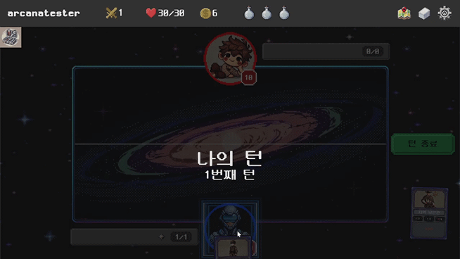
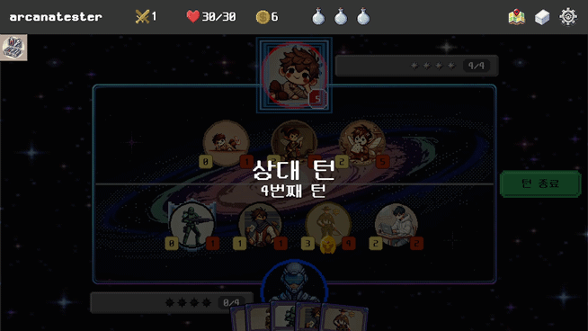
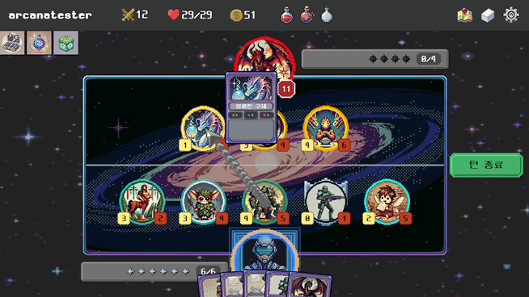
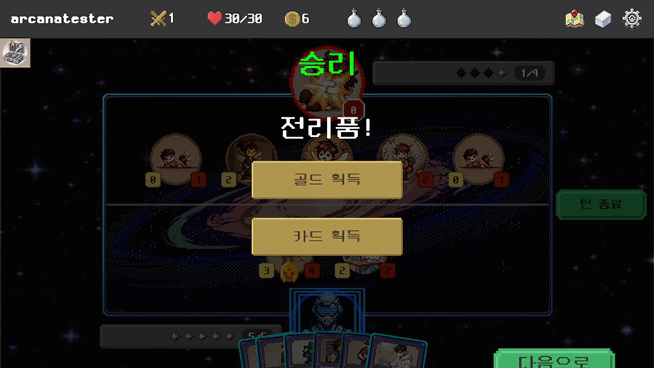
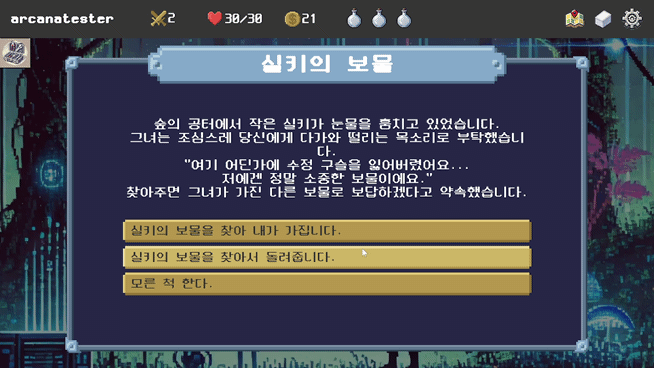
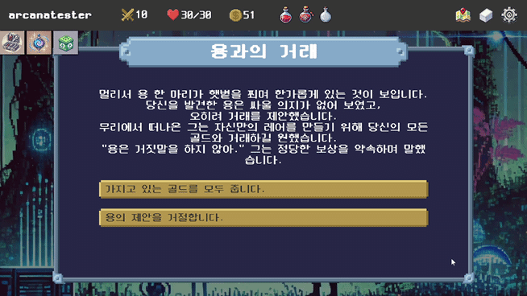

# 🌌 ARCANA

- **배포 URL**: [여기를 클릭!](https://drive.google.com/uc?export=download&id=19Tnss_JmDvrtUmO6CHv4P-XwWhAqTDO5)
- **Test 사용자 ID**: user@arcana.com
- **Test 사용자 PW**: Qwer1234!

## 📜 목차

1. [프로젝트 소개 및 핵심 기능](#1-프로젝트-소개-및-핵심-기능-)
2. [팀원 구성](#2-팀원-구성-)
3. [개발 환경](#3-개발-환경-)
4. [채택한 개발 기술과 브랜치 전략](#4-채택한-개발-기술과-브랜치-전략-)
5. [기능](#5-기능-)
6. [프로젝트 사용 도구](#6-프로젝트-사용-도구-)
7. [외부 서비스](#7-외부-서비스-)
8. [개발 및 배포 컨벤션](#8-개발-및-배포-컨벤션-)

## 1. 프로젝트 소개 및 핵심 기능 🌟

**ARCANA**는 다양한 종족과의 상호작용과 전략적인 덱 구성을 통해 진행되는 **덱빌딩 로그라이크 게임**입니다. 플레이어는 아르카나 행성에서 인류의 생존과 확장을 위해 카드를 모으고 전투를 치러나가야 합니다.

### 주요 기능

1. **덱 빌딩 및 전투 시스템**
   
   - 플레이어는 다양한 종족 카드를 수집하고 전략적으로 덱을 구성하여 전투를 진행합니다.
   - 종족별로 고유한 특성을 활용한 전투 방식은 무한한 전략적 가능성을 제공합니다.

2. **로그라이크 기반의 무한한 재플레이성**
   
   - 매번 새로운 맵과 이벤트가 무작위로 생성되어 플레이할 때마다 다른 경험을 제공합니다.
   - 도전과 보상을 반복하며, 게임의 긴장감과 몰입도를 극대화합니다.

3. **AI 기반 적 행동 시스템**
   
   - Minimax 알고리즘을 활용하여 적의 행동 패턴을 최적화하고, 플레이어의 전략에 맞서는 AI 적을 구현합니다.
   - 적은 가능한 모든 시나리오를 평가한 후, 가장 적절한 행동을 선택하여 전투의 난이도를 조절합니다.

4. **Redis 기반 캐싱 시스템**
   
   - 게임 데이터를 빠르게 접근 및 처리하여 실시간 플레이를 지원합니다.
   - 플레이어의 게임 기록, 진행 상황, JWT 토큰 등을 효율적으로 관리하여 원활한 게임 진행이 가능합니다.

## 2. 팀원 구성 👥

| **강미연**                              | **김세진**                              | **신건우**                              | **손동희**                                    | **허태훈**                                    | **황준**                                    |
| ------------------------------------ | ------------------------------------ | ------------------------------------ | ------------------------------------------ | ------------------------------------------ | ----------------------------------------- |
| [GitHub](https://github.com/422haha) | [GitHub](https://github.com/tpwls30) | [GitHub](https://github.com/singunu) | [GitHub](https://github.com/FarmMachine21) | [GitHub](https://github.com/WinterSleep22) | [GitHub](https://github.com/hwangprogram) |

## 3. 개발 환경 🛠️

- **프론트엔드**: React 18.3.1, Tailwind CSS 3.4.14, TypeScript 5.6.2
- **백엔드**: Java 17, Spring Boot 3.3.1
- **Unity**: 2022.3.50f1
- **데이터베이스**: MySQL 8.0, Redis 7.0
- **인프라**: Ubuntu 20.04.6, Docker 27.3.1, Jenkins 2.482, Nginx 1.18.0

## 4. 채택한 개발 기술 🚀

### 프론트엔드

- **React**: 컴포넌트 기반의 효율적인 UI 개발
- **TypeScript**: 정적 타입을 통해 코드의 안정성과 유지보수성을 향상
- **Tailwind CSS**: 유틸리티 퍼스트 CSS 프레임워크로 빠르고 일관된 스타일링 지원

### 백엔드

- **Spring Boot**: 빠르고 간편한 애플리케이션 개발
- **JPA**: 객체 지향적인 방식으로 데이터베이스 조작
- **Spring Security**: URL 기반의 세밀한 접근 제어
- **JWT**: 토큰 기반 인증을 통한 서버 부하 감소 및 확장성 향상
- **Redis**: 빠른 데이터 접근을 위한 캐싱 시스템

### Unity

- **Unity**: 고성능 게임 개발 엔진
- **C#**: 게임 로직 구현을 위한 주요 언어
- **AI 알고리즘**: Minimax 알고리즘을 통한 적 AI 구현

## 5. 기능 ✨

### 플레이어 진행 관리

- 맵 탐험, 덱 관리, 진행 상황 등이 자동으로 저장되어 언제든지 게임을 이어서 플레이할 수 있습니다.
- 전투 중에도 진행 상황이 저장되어 중단 없이 게임을 즐길 수 있습니다.

### 덱 빌딩 및 전투 시스템

- 다양한 종족의 카드를 수집하고 덱을 구성하여 전략적인 전투를 진행합니다.
- 각 카드의 고유한 능력과 종족 특성을 활용하여 전투에서 승리할 수 있습니다.

### 로그라이크 기반 진행

- 매번 새로운 맵과 이벤트가 무작위로 생성되어, 플레이할 때마다 다른 경험을 제공합니다.
- 실패하더라도 새로운 시작을 통해 다양한 전략을 시도할 수 있습니다.

### 랜덤 이벤트 및 선택 시스템

- 게임 내에서 다양한 랜덤 이벤트가 발생하며, 플레이어의 선택에 따라 진행 방향이 달라집니다.
- 선택에 따라 보상이나 페널티를 받을 수 있어 전략적인 판단이 중요합니다.

## 6. 프로젝트 사용 도구 🛠️

- **형상 관리**: GitLab, Plastic SCM
- **이슈 관리**: Jira
- **커뮤니케이션**: Mattermost, Notion, Discord
- **디자인**: Figma
- **CI/CD**: Jenkins, Docker, Docker Compose, Docker Hub, Nginx, Fail2Ban, ModSecurity, Let's Encrypt
- **정적 코드 분석 도구**: SonarQube

## 7. 외부 서비스 🌐

- **스토리지 서비스**: AWS S3

## 8. 개발 및 배포 컨벤션 📚

### Jira 컨벤션 📈

#### Epic

- 한번 혹은 더 많은 스프린트로 처리할 가장 큰 작업 단위

#### Story

- 코드 변경이 있는 작업

#### Task

- 코드 변경이 없는 작업

### Git 컨벤션 📦

#### 머지 규칙 🔗

- Self Merge 금지
- 전원 코드 리뷰 및 approve 필수

#### 커밋 메시지 📝

- **feat**: 기능 추가, 삭제, 변경 - 제품 코드 수정 발생
- **fix**: 버그 수정 - 제품 코드 수정 발생
- **docs**: 문서 추가, 삭제, 변경 - 코드 수정 없음
- **style**: 코드 형식, 정렬, 주석 등의 변경 - 제품 코드 수정 발생, 하지만 동작에 영향을 주는 변경은 없음
- **refactor**: 코드 리팩토링 - 제품 코드 수정 발생
- **test**: 테스트 코드 추가, 삭제, 변경 등 - 제품 코드 수정 없음
- **chore**: 위에 해당하지 않는 모든 변경 - 코드 수정 없음

### Git Flow 컨벤션 🌲

#### Branch 종류 🌿

1. `master` : production 준비 상태인 브랜치
2. `develop` : 최신 개발 변경 사항이 포함된 브랜치
3. `feature` : 새로운 기능 개발
4. `release` : 새로운 버전이 배포되기 전에 사용
5. `hotfix` : 배포된 버전에서 긴급한 버그가 발생했을 때 사용
